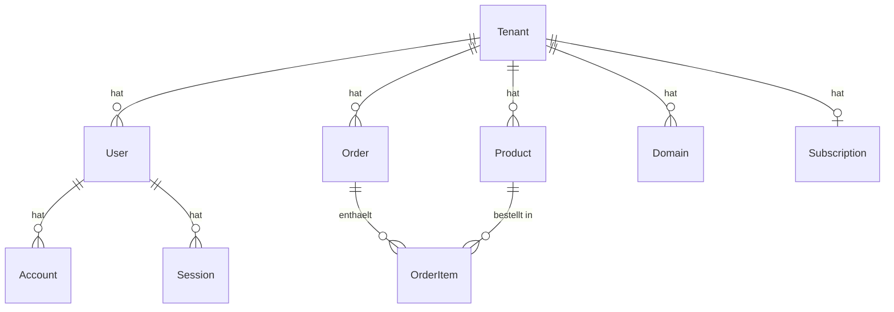

<p align="center">
  
  
  
  
  
</p>

<h1 align="center">🛍️ Shophub</h1>

<p align="center">
  <strong>Multi-Tenant Vertical SaaS E-Commerce-Plattform</strong><br/>
  Erstellen Sie in wenigen Minuten einen professionellen Online-Shop mit branchenspezifischen Vorlagen (Blueprints).
</p>

<p align="center">
  <a href="#-demo">Demo</a> •
  <a href="#-funktionen">Funktionen</a> •
  <a href="#-technologie-stack">Technologie</a> •
  <a href="#-installation">Installation</a> •
  <a href="#-projektstruktur">Struktur</a> •
  <a href="#-deployment">Deployment</a>
</p>

---

## 🌐 Demo

| Blueprint | Branche | Demo-Link |
|-----------|---------|-----------|
| 💊 VitaGlow | Gesundheit & Schönheit | `/storefront` |
| 💎 Goldschmiede Eleganz | Schmuck & Juwelier | `/storefront/schmuck` |
| 🛒 FrischMarkt | Supermarkt | `/storefront/supermarkt` |
| 👗 Stilwerk | Modegeschäft | `/storefront/mode` |
| 🍽️ Gasthaus Zum Goldenen | Restaurant | `/storefront/restaurant` |
| ✈️ Fernweh Reisen | Tourismus | `/storefront/reisen` |

---

## ✨ Funktionen

- **🏗️ Blueprint-System** — Branchenspezifische Vorlagen (Gesundheit, Schmuck, Mode u. v. m.)
- **👥 Multi-Tenancy** — Subdomain-basierte Mandantentrennung, gemeinsame Infrastruktur
- **📦 Produktverwaltung** — CRUD, Kategorien, Bestandsverfolgung, Rabattpreise
- **🛒 Bestellverwaltung** — Statusverfolgung (Ausstehend → Geliefert)
- **🔐 Authentifizierung** — NextAuth.js (Credentials + Google) für sichere Anmeldung
- **🎨 Widget-System** — Modulare, wiederverwendbare UI-Komponenten
- **📱 Responsive Design** — Mobile-first, perfekte Darstellung auf allen Geräten
- **🌍 Mehrsprachig** — Deutschsprachige Demo-Storefronts

---

## 🛠️ Technologie-Stack

| Schicht | Technologie |
|---------|------------|
| **Framework** | Next.js 16 (App Router) |
| **Sprache** | TypeScript 5 |
| **UI** | Tailwind CSS 4, Shadcn/UI, Radix UI |
| **State** | Zustand |
| **Datenbank** | PostgreSQL (Prisma ORM) |
| **Auth** | NextAuth.js (JWT) |
| **Formulare** | React Hook Form + Zod |
| **Zahlung** | Iyzico, Stripe (geplant) |
| **Deployment** | Vercel (Frontend) + Render (DB) |

---

## 🚀 Installation

### Voraussetzungen

- [Node.js](https://nodejs.org/) 18+
- [PostgreSQL](https://www.postgresql.org/) oder SQLite (Entwicklung)

### Schritte

```bash
# 1. Repository klonen
git clone https://github.com/<benutzer>/ShopApp.git
cd ShopApp

# 2. Abhängigkeiten installieren
npm install

# 3. Umgebungsvariablen konfigurieren
cp .env.example .env
# .env-Datei bearbeiten

# 4. Datenbank erstellen
npx prisma db push

# 5. (Optional) Seed-Daten einfügen
npx prisma db seed

# 6. Entwicklungsserver starten
npm run dev
```

Öffnen Sie **http://localhost:3000** in Ihrem Browser.

---

## 📁 Projektstruktur

```
src/
├── app/                       # Next.js App Router
│   ├── (auth)/                # Login- & Registrierungsseiten
│   ├── api/                   # API-Routen (products, auth, tenant)
│   ├── dashboard/             # Mandanten-Admin-Panel
│   │   ├── products/          # Produkt-CRUD-Seiten
│   │   └── layout.tsx         # Dashboard-Layout + Seitenleiste
│   └── storefront/            # Demo-Shop-Seiten
│       ├── schmuck/           # Juwelier-Demo
│       ├── supermarkt/        # Supermarkt-Demo
│       ├── mode/              # Mode-Demo
│       ├── restaurant/        # Restaurant-Demo
│       └── reisen/            # Tourismus-Demo
│
├── blueprints/                # Branchenvorlagen
│   └── health-beauty/         # Gesundheit & Schönheit Blueprint
│       └── components/        # HeroBanner, ProductCard, BenefitsSection
│
├── components/                # Gemeinsame UI-Komponenten
│   ├── ui/                    # Shadcn/UI (Button, Card, Input, Badge...)
│   ├── dashboard/             # DashboardSidebar
│   └── widgets/               # Widget-Komponenten
│
├── core/                      # Plattformkern
│   ├── tenant/                # Mandanten-Context & -Auflösung
│   ├── theme/                 # Theme-Provider
│   └── widgets/               # Widget-Registry & -Renderer
│
├── lib/                       # Hilfsfunktionen
│   ├── prisma.ts              # Prisma-Client
│   ├── auth.ts                # NextAuth-Konfiguration
│   └── utils.ts               # Hilfsfunktionen
│
├── services/                  # Geschäftslogik
│   └── product/               # ProductService (CRUD)
│
├── types/                     # TypeScript-Definitionen
│   ├── blueprint.types.ts
│   └── tenant.types.ts
│
└── middleware.ts               # Mandantenauflösung & Auth-Guard
```

---

## 🗃️ Datenbankschema



---

## ☁️ Deployment

### Vercel (Frontend + API)

1. [vercel.com](https://vercel.com) → **New Project** → GitHub-Repository auswählen
2. Umgebungsvariablen hinzufügen:
   - `DATABASE_URL` — PostgreSQL-Verbindungs-URL
   - `NEXTAUTH_SECRET` — `openssl rand -base64 32`
   - `NEXTAUTH_URL` — Vercel-Domain-URL
3. Auf **Deploy** klicken

### Render (PostgreSQL)

1. [render.com](https://render.com) → **New** → **PostgreSQL**
2. Kostenlosen Plan wählen, Datenbank erstellen
3. **External Database URL** kopieren → Als `DATABASE_URL` in Vercel einfügen

---

## 📋 Roadmap

- [x] Next.js 16 + TypeScript + Tailwind Setup
- [x] Prisma + PostgreSQL Datenbank
- [x] Multi-Tenant Middleware
- [x] NextAuth.js Authentifizierung
- [x] Blueprint-System (6 Branchen-Demos)
- [x] Produkt-CRUD (API + Dashboard)
- [ ] Kategorieverwaltung
- [ ] Bestellverwaltung
- [ ] Warenkorb-Funktion
- [ ] Iyzico Zahlungsintegration
- [ ] Custom-Domain-Unterstützung
- [ ] Admin-Panel (Super Admin)
- [ ] KI-gestützte Preisgestaltung

---

## 🤝 Mitwirken

1. Repository forken
2. Feature-Branch erstellen (`git checkout -b feature/tolles-feature`)
3. Änderungen committen (`git commit -m 'feat: tolles Feature hinzufügen'`)
4. Branch pushen (`git push origin feature/tolles-feature`)
5. Pull Request öffnen

---

## 📄 Lizenz

Dieses Projekt ist unter der [MIT](LICENSE)-Lizenz veröffentlicht.

---

<p align="center">
  <sub>Erstellt mit ❤️ vom <strong>Shophub-Team</strong></sub>
</p>
